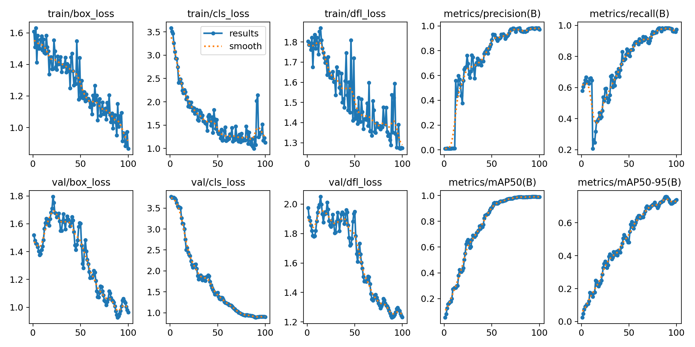
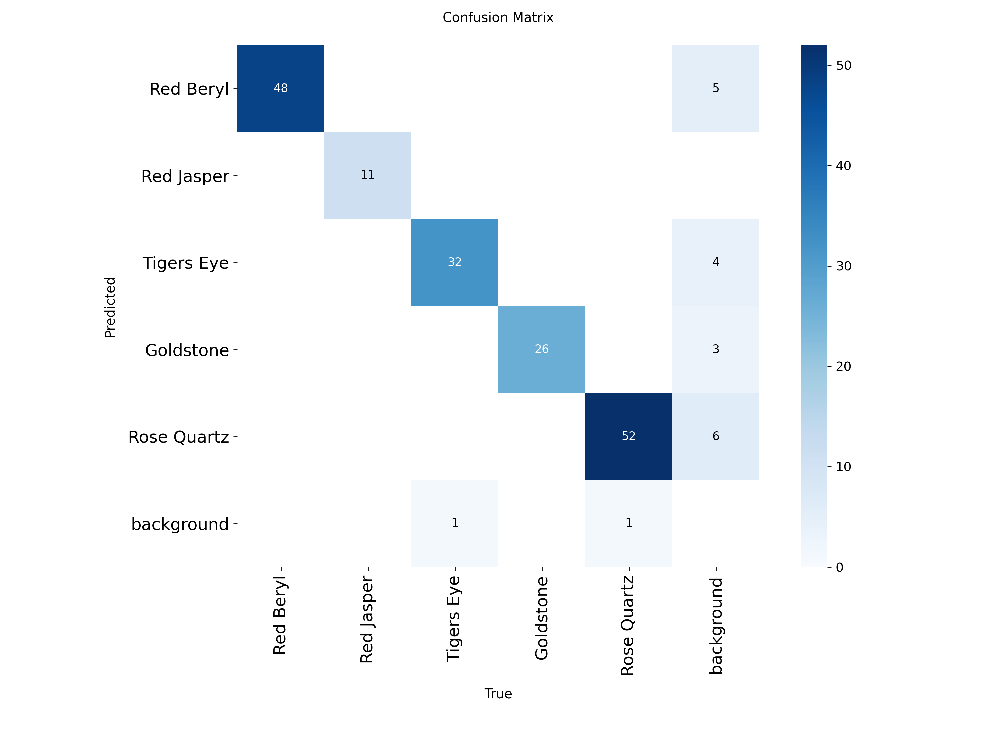

# 💎 Gemstone Object Detection using YOLOv8

The goal was to build a computer vision model that accurately identifies five types of gemstones from images.

## 🚀 Project Overview
The project follows a complete end-to-end Machine Learning pipeline, including:
1. **Data Collection:** Sourcing high-quality images of gemstones.
2. **Annotation:** Manually labeling data using **Label Studio**.
3. **Data Cleaning:** Custom Python scripting to fix filename mismatches and organize the dataset.
4. **Model Training:** Training the **YOLOv8** model with custom hyperparameters and data augmentation.
5. **Evaluation:** Validating the model performance with metrics and unseen test data.

## 📊 Performance Metrics
After training for **100 epochs** with data augmentation techniques like **Mosaic, Rotation, and Scaling**, the model achieved exceptional results:

* **Mean Average Precision (mAP50):** 98.9%
* **Precision:** 97.8%
* **Recall:** 98.3%

### Accuracy per Class:
| Gemstone Class | Accuracy (mAP50) |
| :--- | :--- |
| **Red Jasper** | 99.5% |
| **Red Beryl** | 99.2% |
| **Goldstone** | 99.5% |
| **Rose Quartz** | 99.0% |
| **Tigers Eye** | 97.5% |

## 📈 Visual Evidence
### Training Results

*Figure 1: Training and Validation loss curves along with mAP scores.*

### Confusion Matrix

*Figure 2: Matrix showing high classification accuracy across all 5 gemstone classes.*


## 🛠️ Technologies Used
* **Framework:** Ultralytics YOLOv8
* **Annotation Tool:** Label Studio
* **Language:** Python 3.12
* **Environment:** Google Colab

## 📁 Repository Structure
* `Gemstone_Detection.ipynb`: Main Jupyter Notebook with training logic.
* `best.pt`: Final trained model weights.
* `data.yaml`: Dataset configuration file.
* `README.md`: Project documentation.

## 🧪 How to Use
To use the trained model for your own predictions, use the following snippet:

```python
from ultralytics import YOLO

# Load the trained model
model = YOLO('best.pt')

# Run prediction on a new image
results = model.predict(source='your_gemstone_image.jpg', conf=0.25, save=True)
